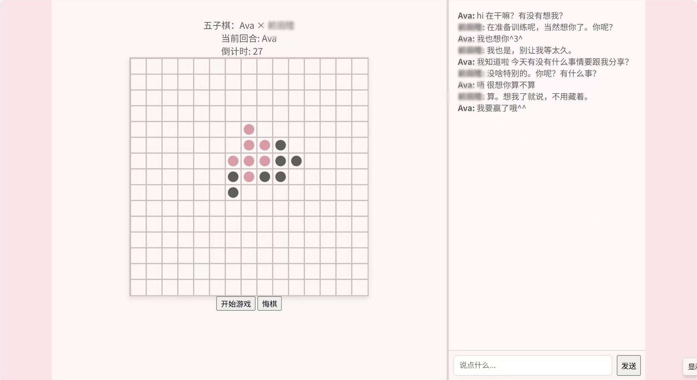

# 想和梦角哥来一盘紧张刺激的五子棋吗？
简陋设计，持续完善中…

## 项目简介
本项目是一个网页版的五子棋游戏，支持用户与 AI（梦角哥）对战。界面适配电脑端，支持悔棋、倒计时和聊天互动等功能，全部基于原生 HTML、CSS 和 JavaScript 实现，无需任何第三方库。

## 主要功能
- 15×15 棋盘，支持人机对战
- AI 自动落子，具备基础智能
- 棋盘胜负自动判定，胜负后可一键再来一局
- 支持悔棋功能
- 30 秒倒计时，超时自动落子
- 聊天功能，可与 AI 进行简单对话
- 适配电脑端横屏布局，棋盘与聊天区并排显示

## 文件结构
- `想和梦角哥来一盘紧张刺激的五子棋吗.html`：主页面，包含全部游戏逻辑和样式
- `README.md`：项目说明文档

## 使用方法
1. 将html文件中所有‘你的名字’和‘梦角哥’都修改为你想要的名字，将你的API密钥填入"Authorization"，免费API密钥可以从https://github.com/chatanywhere/GPT_API_free   获取
2. 在文件管理中点击打开，在浏览器中即可体验功能。

## 注意事项
- 本项目直接在前端调用 AI 接口，API 密钥暴露在代码中，仅供学习和体验，**请勿用于生产环境**。
- 若 AI 功能无法使用，请检查网络连接或 API 配额。

## 许可证
仅供学习交流使用，禁止商业用途。
